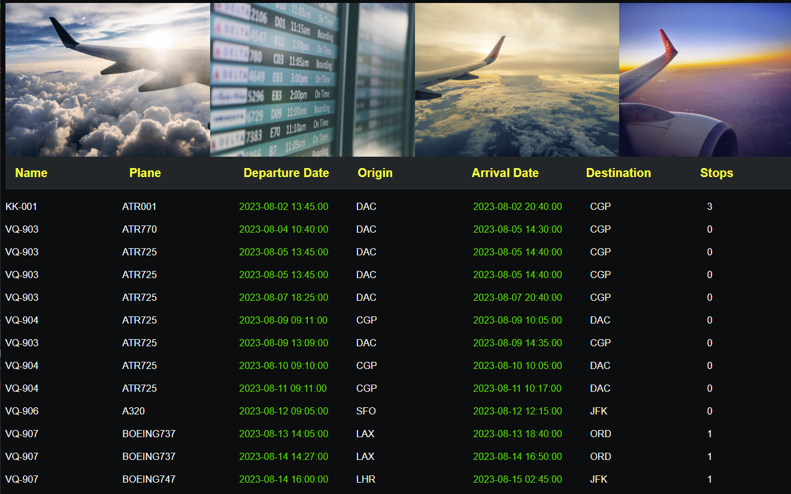

# Flights

> A simple project displaying flights information.

## Table of contents

- [Flights](#flights)
  - [Table of contents](#table-of-contents)
  - [General info](#general-info)
  - [Screenshots](#screenshots)
  - [Technologies](#technologies)
  - [Setup](#setup)
  - [Code Examples](#code-examples)
  - [Status](#status)

## General info

> Flight schedule. The objective of the project is to practice separation of
> concern in JavaScript.

## Screenshots



## Technologies

- JavaScript
- HTML5
- CSS3
- VSC code
- Jest testing

## Setup

clone the repo and run npm install.

## Code Examples

```js
const loadHandler = () => {
	const organizedFlights = data.flights.sort((a, b) => {
		return (
			new Date(a.departureDate).getTime() - new Date(b.departureDate).getTime()
		);
	});
};
```

## Status

Project is: _done_
